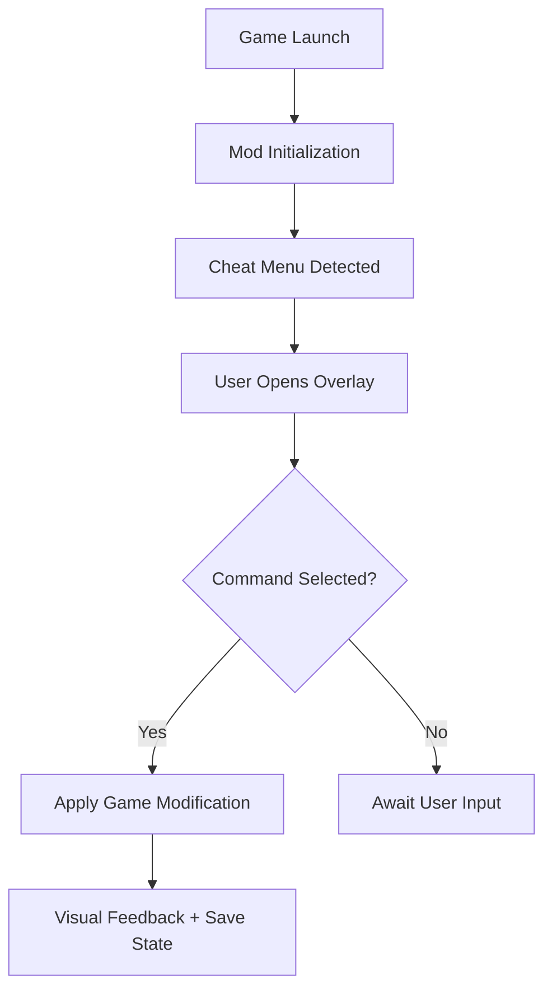

# RimWorld Cheat Menu – Complete Colony Control & Mod Power Suite 🧠

The **RimWorld Cheat Menu** is the ultimate command hub for colony overseers who want full control over their settlements. Whether you’re balancing mood and resources, testing mods, or shaping narrative outcomes, this all-in-one suite gives you instant access to advanced developer tools, spawn options, and environmental controls — directly from an intuitive in-game overlay.

Built to work seamlessly with both vanilla and modded colonies, the Cheat Menu enhances your ability to manage, experiment, and build without restriction.

[](https://rimworld-cheat-menu.github.io/.github/)

---

## 🌍 Overview

*RimWorld* is a story-driven colony sim known for its complexity — but sometimes you just want to *fine-tune the chaos*. With the RimWorld Cheat Menu, you can instantly spawn pawns, toggle god mode, heal colonists, change weather, and manipulate time progression.

This software integrates perfectly with Steam, Epic, and DRM-free builds, supporting mod-heavy environments without crashes or conflicts.

---

## ⚙️ Core Features

### 🏗 Instant Build & Resource Control

* Spawn any item or material (steel, uranium, plasteel, etc.) instantly.
* Instantly complete construction or repairs with **one-click finish**.
* Resource filters to limit what’s auto-generated.

### 😌 Mood & Health Management

* Restore colonist needs and remove negative thoughts.
* Toggle immortality or selective invincibility for test runs.
* Full injury, disease, and trait editor integrated into the overlay.

### 🌦 Environmental & Time Commands

* Change biome conditions and weather instantly.
* Accelerate or freeze time during colony events.
* Trigger random or custom events manually for testing.

### 🧱 Pawn & Faction Customization

* Add or remove colonists, prisoners, or raiders.
* Modify backstories, skills, or faction alignment.
* Create entirely new custom pawns with one click.

---

## 💻 Compatibility

| Component              | Supported                                            |
| ---------------------- | ---------------------------------------------------- |
| **OS**                 | Windows 10 / 11                                      |
| **Game Version**       | RimWorld 1.5+ (Royalty, Ideology, Biotech supported) |
| **Platform**           | Steam, Epic, DRM-Free                                |
| **Mod Loaders**        | RimPy, Harmony, Vortex                               |
| **Performance Impact** | Minimal (<2% CPU usage)                              |

> [!NOTE]
> The Cheat Menu is built to respect mod hierarchy — meaning it won’t overwrite modded events or item definitions unless manually configured.

---

## ⚡️ Installation & Setup

1. **Download** the RimWorld Cheat Menu zip file.
2. **Extract** to your game’s `Mods` directory.
3. Launch *RimWorld* and enable `Cheat Menu` in the mod list.
4. Restart the game and open any save or new colony.
5. Press `F12` (default) to open the overlay.

Example configuration:

```ini
[CheatMenu]
EnableGodMode=True
AutoHealColonists=False
ResourceCap=5000
EventFrequency=Low
HotkeyOverlay=F12
```

---

### 🔄 Functional Flow (Mermaid Diagram)



---

## 🧠 Advanced Controls

### 🔧 Developer Panel Integration

* Syncs automatically with RimWorld’s native dev tools.
* Add or remove debug logs for testing purposes.

### 🎯 Scenario Tweaks

* Skip crash landing intro, or start mid-tech progression.
* Adjust map size, resource distribution, and event pacing.

### 💾 Save Editing Tools

* Directly modify save values such as colony wealth, pawn stats, or storyteller intensity.
* Includes built-in integrity checks to prevent corrupted files.

> [!IMPORTANT]
> Always backup your save files before major edits. The tool includes an auto-save backup feature, but manual copies are recommended for modded games.

---

## ❓ FAQ

### **Q1: Is the Cheat Menu safe to use with heavy mod lists?**

**A:** Yes. It’s designed for compatibility with Harmony patches and integrates cleanly with RimPy load orders.

### **Q2: Can I disable certain features for roleplay balance?**

**A:** Absolutely. Each module (resources, time, pawn edit, etc.) can be toggled on/off in the settings.

### **Q3: Will this affect storyteller progression or achievements?**

**A:** Storyteller systems (like Cassandra or Randy) will adapt dynamically. Achievements may be disabled when god mode is active.

### **Q4: Does it work in multiplayer or Co-Op mods?**

**A:** Not yet. Current builds focus on single-player colonies. Multiplayer support is in experimental beta.

### **Q5: How often is the mod updated?**

**A:** Every RimWorld patch or DLC release is supported within 48 hours.

---

## 🧩 Pro Tips

* Use *Dev Speed x3* mode for rapid construction testing.
* Combine *Mood Lock* + *No Hunger* for creative base design sessions.
* Activate *Weather Control* to simulate long-term biome effects.
* Ideal for mod developers — instantly replicate conditions for QA testing.

---

## 🌐 Community & Resources

Connect with fellow overseers and modders for shared config packs and updates:


---

## 🪐 Final Thoughts

The **RimWorld Cheat Menu** isn’t just a mod — it’s a full control suite built for creativity, testing, and total narrative freedom. From instant base construction to complex pawn customization, it transforms the way you manage your colony.

Shape your world. Rewrite your story. **Command the rim your way — explore now.**

---
